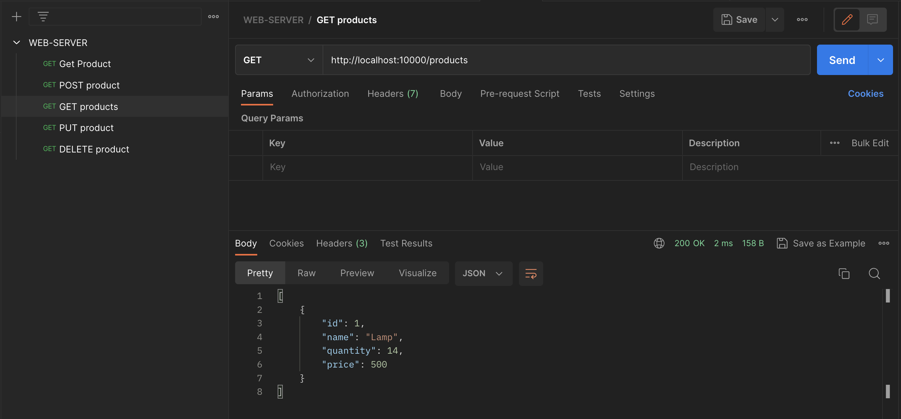

# Go-CRUD-API-Project




This project is a **Go-based CRUD API for inventory management** of products. It utilizes MySQL for persistent data storage and provides API endpoints for managing your inventory through:

* **GET:** Retrieve information about existing products.
* **POST:** Create new products and add them to your inventory.
* **PUT:** Update existing product details in your inventory.
* **DELETE:** Remove unwanted products from your inventory.

This API empowers you to manage your product stock efficiently, facilitating tasks like:

* Tracking product quantities and prices.
* Adding new products to your inventory.
* Updating existing product details like descriptions or variations.
* Removing or archiving products no longer available.

This is a simple yet powerful tool for developers and individuals wanting to build applications with inventory management capabilities.


## Prerequisites

- **Go:** https://go.dev/doc/install
- **MySQL:** https://dev.mysql.com/downloads/

## Installation and Setup

1. **Install and Run MySQL:**
   - Follow the instructions for your operating system to install and start the MySQL server.

2. **Choose MySQL User:**

   - **Use Root User:** If you prefer to use the root user, you can skip steps 2.1 and 2.2. However, using a dedicated user with limited privileges is generally recommended for security reasons.

   - **Create a New User:** To create a separate user with appropriate permissions, proceed with the following steps:
      - Access the MySQL console:
        ```bash
        mysql -u root -p
        ```
      - Create a user (replace `username` and `password` with your desired credentials):
        ```sql
        CREATE USER 'username'@'localhost' IDENTIFIED BY 'password';
        ```
      - Grant necessary permissions to the user:
        ```sql
        GRANT ALL PRIVILEGES ON *.* TO 'username'@'localhost';  # Grant all privileges for simplicity, but consider granting only specific privileges for better security
        ```

3. **Create Database and Table:**
   - Create the database:
     ```sql
     CREATE DATABASE Inventory;
     ```
   - Switch to the database:
     ```sql
     USE Inventory;
     ```
   - Create the table:
     ```sql
     CREATE TABLE products (
         id int NOT NULL AUTO_INCREMENT,
         name varchar(255) NOT NULL,
         quantity int,
         price float(10,7),
         PRIMARY KEY(id)
     );
     ```

4. **Store Password :**
   - Store the MySQL password securely in your environment:
     ```bash
     echo "export DB_PASSWORD=Your_Password" >> ~/.zshrc  # For Z shell
     export DB_PASSWORD=Your_Password  # For current session
     ```

## Building and Running the Project

1. **Build the Project:**
   ```bash
   go build

2. **Run the executable:**
   ```bash
   ./file_name
